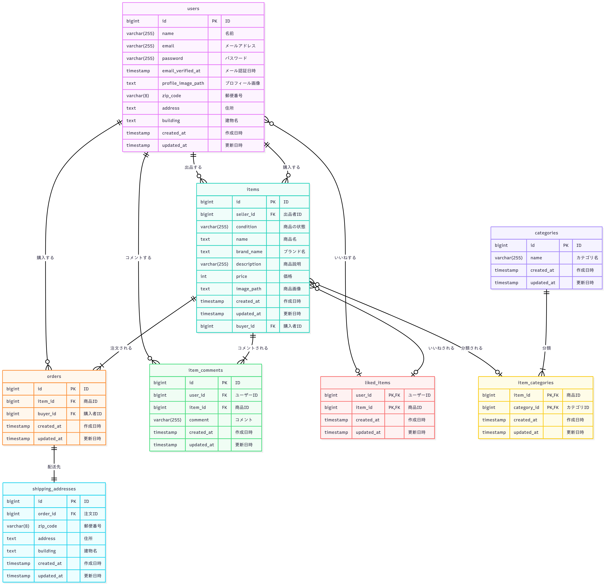

# COACHTECH フリマアプリ

これは、COACHTECHの模擬案件で作成したフリマアプリケーションです。

## ✨ 機能一覧

### 既存機能

- 会員登録(メール認証)、ログイン・ログアウト機能
- プロフィール編集機能（アバター画像、ユーザー名、住所など） **[改修]**: 取引中の商品タブ、評価平均表示を追加
- 商品一覧表示、検索機能
- 商品出品機能
- 商品詳細表示機能
- 商品購入機能
- コメント投稿機能
- いいね機能

### 新規追加機能 **[新規]**

- **取引中の商品確認機能**: マイページから取引中の商品を確認できる
- **取引チャット機能**: 取引相手とのメッセージ送信（本文・画像添付対応）
- **メッセージ編集・削除機能**: 投稿済みメッセージの編集・削除
- **取引完了機能**: 商品購入者が取引を完了することができる
- **取引後評価機能**: 取引完了後に相手ユーザーを評価（1〜5段階）
- **評価平均確認機能**: プロフィール画面で評価の平均値と星アイコンを表示
- **未読メッセージ通知機能**: 取引中の商品の未読メッセージ数を通知バッジで表示
- **取引完了通知メール送信機能**: 取引完了時に出品者宛に自動で通知メールを送信

## 🚀 技術スタック

- **バックエンド**: Laravel, PHP
- **フロントエンド**: Blade, CSS, JavaScript
- **データベース**: MySQL
- **開発環境**: Docker, Docker Compose

---

## 💻 環境構築手順

このアプリケーションをローカル環境で起動するための手順です。

### 必須要件

- Docker
- Docker Compose

### セットアップ

1. **リポジトリのクローン**

   ```bash
   git clone https://github.com/hgleam/coachtech-flea-market.git
   cd coachtech-flea-market
   ```
2. **.env ファイルの準備**
   `src` ディレクトリにある `.env.example` ファイルをコピーして `.env` ファイルを作成します。

   ```bash
   cp src/.env.example src/.env
   # .env ファイルを編集して、docker-compose.ymlのmysqlコンテナ設定(DB_HOST, DB_DATABASE, DB_USERNAME, DB_PASSWORD)を確認・設定
   # mysqlのサービス名 → .envのDB_HOST
   # MYSQL_DATABASE → .envのDB_DATABASE
   # MYSQL_USER → .envのDB_USERNAME
   # MYSQL_PASSWORD → .envのDB_PASSWORD
   # MAIL_HOST → mailhogのサービス名を設定
   # MAIL_FROM_ADDRESS → メールアドレスを設定(例：test@example.com)
   # MAIL_FROM_NAME → メールアドレスの名前を設定(例：Coachtech Flea Market)
   ```
3. **Dockerコンテナのビルドと起動**

   ```bash
   docker compose build
   docker compose up -d
   ```
4. **PHP依存パッケージのインストール**

   ```bash
   docker compose exec php composer install
   ```
5. **アプリケーションキーの生成**

   ```bash
   docker compose exec php php artisan key:generate
   ```
6. **データベースのマイグレーションと初期データ投入**
   以下のコマンドで、データベースのテーブル作成と初期データの投入を同時に行います。
   Seederには、動作確認用のユーザー、カテゴリ、商品データが含まれています。

   ```bash
   docker compose exec php php artisan migrate --seed
   ```
7. **ストレージへのシンボリックリンク作成**
   ユーザーがアップロードした画像などを公開するために、以下のコマンドを実行してシンボリックリンクを作成します。

   ```bash
   docker compose exec php php artisan storage:link
   ```
8. **アプリケーションへのアクセス**
   上記の手順が完了したら、ブラウザで以下のURLにアクセスしてください。

   - アプリケーション: [http://localhost:81](http://localhost:81)
   - phpMyAdmin: [http://localhost:8080](http://localhost:8080)
   - MailHog (メール確認用): [http://localhost:8025](http://localhost:8025)

   MailHogは開発用のメールサーバーです。会員登録時の認証メールなどは、実際のメールボックスではなくMailHogのWeb UIに届きますので、こちらでご確認ください。

---

## 🧪 テストの実行

このアプリケーションではPHPUnitを使用してテストを実行します。

### テストの実行方法

すべてのテストを実行する場合は、以下のコマンドを使用してください：

```bash
docker compose exec php php artisan test
```

または、従来のPHPUnitコマンドを使用することもできます：

```bash
docker compose exec php vendor/bin/phpunit
```

### 特定のテストファイルのみ実行する場合

特定のテストファイルのみを実行する場合は、以下のようにパスを指定します：

```bash
docker compose exec php php artisan test tests/Feature/TradeChatTest.php
```

---

### テスト用アカウント

`--seed` オプションでデータベースを初期化すると、以下のテスト用アカウントが作成されます。動作確認に利用してください。

#### ユーザーダミーデータ

初期環境構築時には、以下の3つのユーザーデータが作成されます：

1. **出品者アカウント1（C001-C005の商品データを出品）**

   - メールアドレス: `test1@example.com`
   - パスワード: `password!!`
   - 備考: このアカウントは以下の商品を出品しています。
     - C001: 腕時計
     - C002: HDD
     - C003: 玉ねぎ3束
     - C004: 革靴
     - C005: ノートPC

2. **出品者アカウント2（C006-C010の商品データを出品）**

   - メールアドレス: `test2@example.com`
   - パスワード: `password!!`
   - 備考: このアカウントは以下の商品を出品しています。
     - C006: マイク
     - C007: ショルダーバッグ
     - C008: タンブラー
     - C009: コーヒーミル
     - C010: メイクセット

3. **未紐付けユーザーアカウント**

   - メールアドレス: `test3@example.com`
   - パスワード: `password!!`
   - 備考: このアカウントは会員登録しただけで、商品の出品・購入などの紐付けが一切ない状態です。

---

## 📋 主要な画面

### 一般ユーザー画面

- **商品一覧画面** (`/`): 商品の一覧表示と検索機能
- **商品詳細画面** (`/item/{item}`): 商品の詳細情報表示、いいね機能、コメント投稿
- **商品出品画面** (`/sell`): 新規商品の出品
- **商品購入画面** (`/purchase/{item}`): 商品購入と送付先住所の確認・変更
- **送付先住所編集画面** (`/purchase/address/{item}`): 購入時の送付先住所の編集
- **プロフィール画面** (`/mypage`) **[改修]**: マイページ（出品した商品、購入した商品、取引中の商品の表示）。取引中の商品タブ、未読メッセージ通知、評価の星アイコン表示を追加
- **プロフィール編集画面** (`/mypage/profile`): プロフィール情報（アバター画像、ユーザー名、住所など）の編集
- **取引チャット画面** (`/trade/chat/{item}`) **[新規]**: 取引相手とのチャット、メッセージ送信・編集・削除、取引完了、取引後の評価機能

### 認証関連画面

- **ログイン画面**: Laravel Fortifyにより提供される認証画面
- **会員登録画面**: 新規ユーザー登録
- **メール認証画面** (`/email/verify`): メール認証の確認画面

---

## 🔧 開発・デバッグ

### コード品質チェック

このプロジェクトでは、コード品質を保つために以下のツールを導入しています。

#### Larastan (静的解析)

```bash
# 型チェックとコード品質の分析
docker compose exec php ./vendor/bin/phpstan analyse app --memory-limit=512M --level=5
```

設定ファイル: `phpstan.neon`

#### PHP CS Fixer (コード整形)

```bash
# 未使用のuse文を削除
docker compose exec php ./vendor/bin/php-cs-fixer fix app --rules=no_unused_imports

# テストファイルの未使用のuse文を削除
docker compose exec php ./vendor/bin/php-cs-fixer fix tests --rules=no_unused_imports

# 全体的なコード整形
docker compose exec php ./vendor/bin/php-cs-fixer fix app
```

---

## ER図


